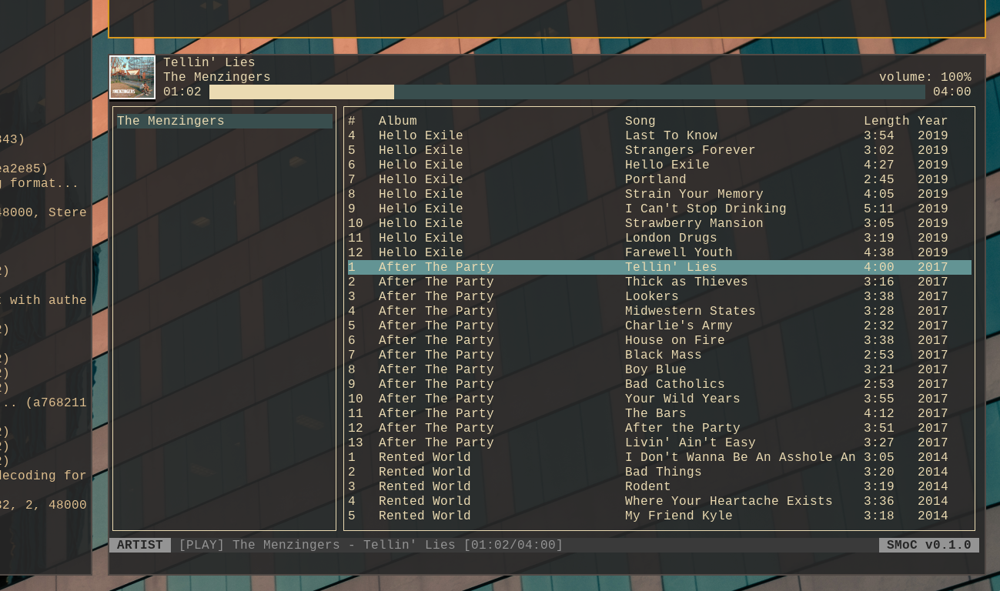

# SMoC
Steaming Music on Console

A TUI music player for streaming services. The currently implemented streaming service is YouTube Music (YTM).

This project is not supported or endorsed by Google. In fact, it has nothing to do with Google or YouTube; this is purely a hobby project. The same warnings and disclamers for the well-known [yt-dlp](https://github.com/yt-dlp/yt-dlp) project apply here.

This project is made possible by:
- [Terminal.Gui](https://github.com/gui-cs/Terminal.Gui) - TUI Framework
- [SoundFlow](https://github.com/LSXPrime/SoundFlow) - Cross-platform Audio
- [YouTubeMusicAPI](https://github.com/IcySnex/YouTubeMusicAPI) - C# YouTube Music API Client

## Commands
SMoC operates via a vim-style command bar. Switching between views and performing many actions occur via the bottom command bar. Much like vim, hitting the `:` key will activate COMMAND mode. The following commands are supported:
- `:a`: Switch to the ARTIST mode
- `:a/<artist name>`: Switch to the ARTIST mode and search for a given artist
- `:t`: Switch to the TRACK mode
- `:t/<track name>`: Switch to the TRACK mode and search for a given track
- `:p`: Switch to the PLAYLIST mode
- `:p/<playlist name>`: Switch to the PLAYLIST mode and search for a given playlist
- `:likes`: Switch to PLAYLIST mode and load the list of songs the user has liked
- `:np`: Switch to the now playing mode (current playback queue)
- `:v/<volume>`: Change volume to the specified value
- `:q`: Quit

## Playback Hotkeys
Playback can be controlled via the following hotkeys:
- `space`: Play/Pause
- `ctrl+space`: Stop
- `,` (comma): Previous Track (or restart track if > 10 seconds into song)
- `.` (period): Next Track
- `[`: Seek backward 10 seconds
- `]`: Seek forward 10 seconds

## Browsing and Tables
Browsing elements in a table can be done with either directional arrow keys (`up`, `down`, `left`, `right`) or vim bindings (`h`, `j`, `k`, `l`). The current active table can be changed by either navigating left and right or pressing tab. Actions can be performed on the currently selected element by either pressing an action shortcut (below) or pressing `enter` which will bring up a context-specific action pop-over.

### Track Tables
TODO: List action bindings

### Search Tables
TODO: List action bindings

## Cookies
In order to play most tracks, you will need to authenticate with a Google acocunt that has a valid YouTube Music Subscription.

### Browser Auth Setup Steps
It is recommended to do this in a new incognito/private window and immediately closing the window without logging out.

1. Open YouTube Music in your browser - ensure you are logged in.
1. Open web developer tools (F12).
1. Open Network tab and locate a POST request to `music.youtube.com`.
1. Copy the `Cookie` into a text file named `cookie.txt` into your local smoc config directory. Note you will need to create the directory if it does not exist. This will usually be `~/.config/smoc/cookie.txt`.

### PO Token and Visitor Data
More recently, additional tokens are often needed. SMoC can generate these for you if you have provided a valid cookie in the `cookie.txt` file. Run `smoc --gentokens`; this will create a `tokens.json` file in the same config directory.

## Development
SMoC is currently in active development. Please report any issues you may encounter.

This project is written in C# using the .NET 10 SDK. We're following the [Google C# Style Guide](https://google.github.io/styleguide/csharp-style.html).

Commits follow the [Conventional Commits](https://www.conventionalcommits.org/en/v1.0.0/) specification with branches and PRs following [Conventional Branch](https://conventional-branch.github.io/).

### Planned Features
- [ ] Playback
  - [x] Play
  - [x] Pause
  - [x] Stop
  - [x] Skip
  - [x] Previous
  - [x] Start Over
  - [ ] Repeat Track
  - [x] Volume
  - [ ] Playback Device Selection
  - [ ] Gapless Playback
- [ ] Queue
  - [x] Add to End of Queue
  - [x] Queue Next (after current song)
  - [ ] Remove
  - [x] Advance to Next at End of Song
  - [ ] Repeat Queue
  - [ ] Shuffle
- [x] Search
  - [x] Artist
  - [x] Track
  - [x] Playlist
- [ ] YouTube Music
  - [x] Authentication
  - [x] POToken
  - [x] VisitorData
  - [x] Play Audio Stream
  - [x] Album Art
  - [ ] Caching
  - [x] History Tracking
  - [ ] Like
  - [ ] Dislike
